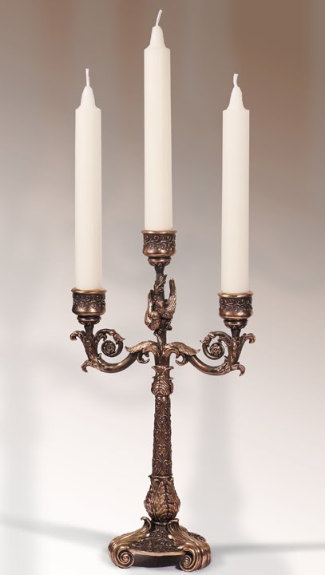

# CANDELABRUM

## Synopsis

`Candelabrum` - a special portable stand for candles. Often made from iron or other alloy's of metall's. `Candelabrum` is invariable attribute of all butlers. Unusual but very common use of `candelabrum` is as murder weapon. `Candelabrum` is often used by butlers, american college students, middle-aged womens and enemys of famous detectives.       

## Code Example

Basic use:
> HOURS = 16  
> WHILE (ONDUTY)   
>   WALK WITH CANDELABRUM  
>   HOURS--  
>   IF (HOURS == 0)  
>      GO SLEEP     
>

## Motivation

`Candelabrum` exists because people's love light and in all periods of humanity history they are were searching of possibilities to take the light on the trip. They wanted to take light to next room, to the basement, the the neighbor house, to the closet.

## Installation

1. Find iron 
2. Find forge with smith
3. Forge 2 iron sticks and small cups for candles
4. Step below:

> TAKE IRON-STICK1  
> MAKE SKELETON  
>    PUT IRON-STICK2 ON IRON-STICK2    
> N - number of SMALL-CANDLE-HOLDERS   
> WHILE (N)  
>   PUT SMALL-CANDLE-HOLDERS ON SKELETON  
>   N--  
> TAKE CANDELABRUM = SKELETON  
>

## API Reference

More information about `candelabrum` can be found here:
<ul>
    <li> [Candelabrum](https://en.wikipedia.org/wiki/Candlestick) </li>
    <li> [Paracas Candelabra](https://en.wikipedia.org/wiki/Paracas_Candelabra) </li>
</ul>>
In Internet can be found pictures of `candelabrum`.

## Tests

Ask your butler to escort you to the restroom. If he takes `candelabrum` than everything works fine. If sonething went wrong try to repeat **Instalation** and make a new `candelabrum`.   

## Contributors

See the light. Join us on [Facebook](https://www.facebook.com/CANDELABRUM-116938974985050/).

## License

The gist of `candelabrum` is open source. 