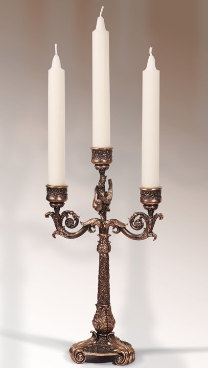

# CANDELABRUM

## Synopsis

`Candelabrum` - a special portable stand for candles. Often made from iron or other alloy's of metall's. `Candelabrum` is invariable attribute of all butlers. Unusual but very common use of `candelabrum` is as murder weapon. `Candelabrum` is often used by butlers, american college students, middle-aged womens and enemys of famous detectives.       

## Code Example

Basic use:
> TAKE IRON-STICK1
> MAKE SKELETON 
>    PUT IRON-STICK2 ON IRON-STICK2   
> WHILE (N)
>   PUT SMALL-CANDLES-HOLDERS ON SKELETON
>   N--
> TAKE CANDELABRUM = SKELETON
> HOURS = 16
> WHILE (ONDUTY) 
>   WALK WITH CANDELABRUM
>   HOURS--
>   IF (HOURS == 0)
>      GO SLEEP     
>